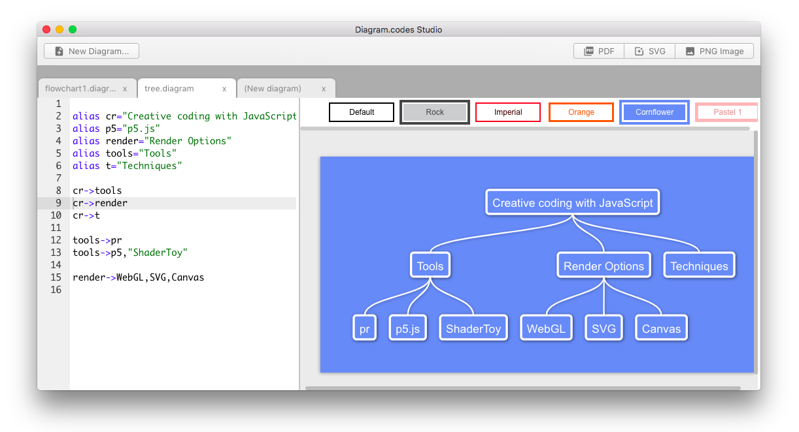
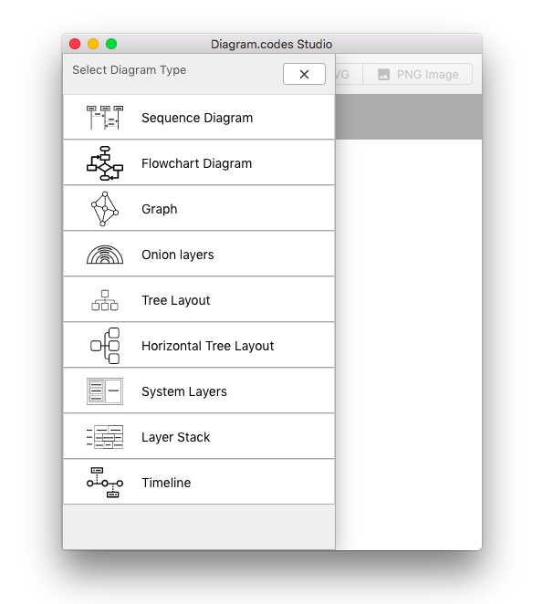

This repository contains the archived binary files for the Diagram Codes Desktop application (for MacOS and Windows).

Diagram Codes is an application for creating diagrams from text descriptions, it's similar to Mermaid and other solutions but has a simpler to use syntax that's friendly to non technical users.

## Download and usage docs

Download it from here https://github.com/hugozap/diagram-codes-desktop-app/releases/tag/v1.0.40

Please refer to the manual for usage instructions

https://hugozap.github.io/diagram-codes-desktop-app/

The software not in development anymore and is provided "AS IS" (see license) but it's still a useful tool for diagram creation.

