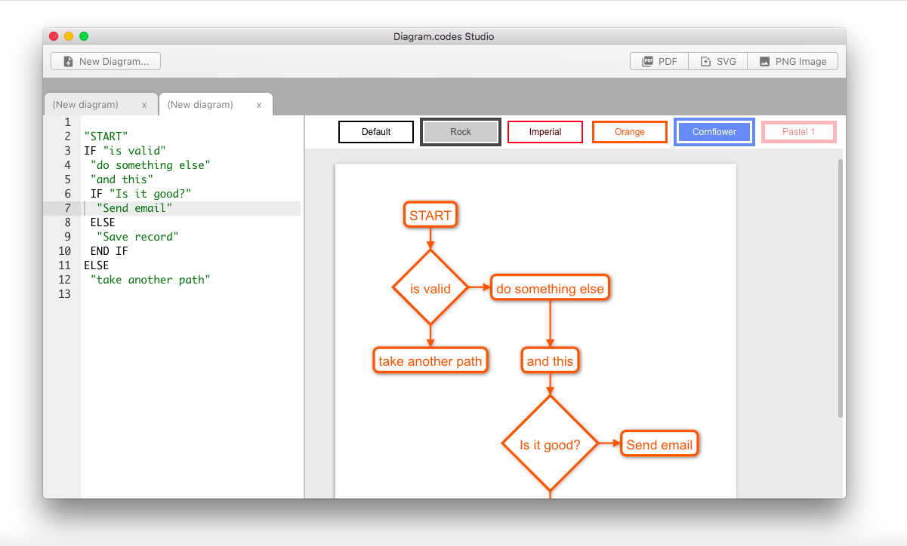
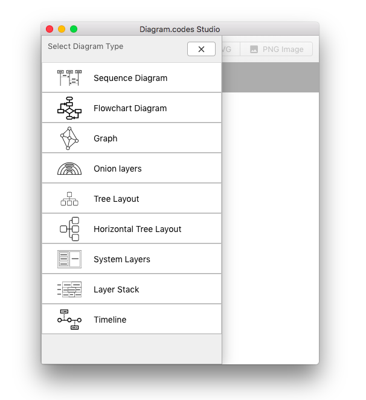
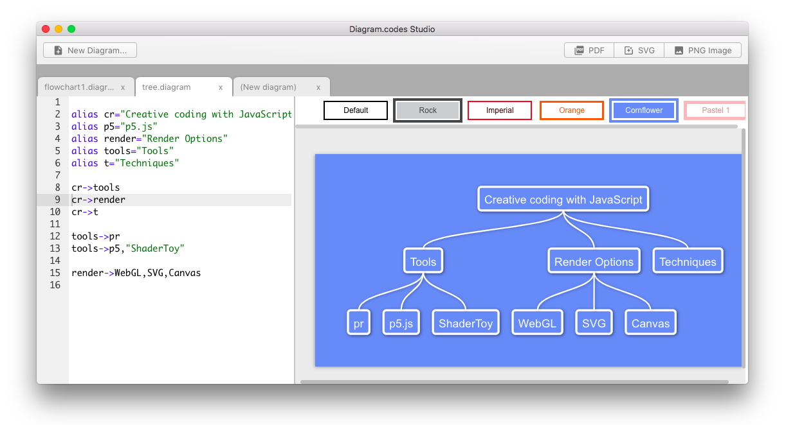

# Diagram.codes Studio User Manual.

## Welcome to Diagram.codes Studio (DCS)

DCS allows users to quickly create diagrams using simple text conventions. 
With this approach the user can focus on the information and its relations instead
of having to manually arrange elements to create the diagram (a time consuming process). DCS automatically
finds a visual arrangement.

## User Interface elements

- Editor Area.
- Diagram Preview.
- Theme selector.

## Creating a Diagram file

There's 2 ways to create a diagram:

- Click on the "New Diagram" button 
- Use a keyboard shortcut Ctrl+n for Windows or Cmd+n for Mac

Then, select the type of diagram:

Everytime you create a diagram a simple example is loaded,
feel free to delete it or change it.

## Saving a Diagram file

Files are saved with the .diagram extension.

You can save a file with Ctrl+s (windows) or Cmd+s (mac)

## Openning a Diagram file

- Ctrl+O (Windows)
- Cmd+O (Mac)

## Exporting Diagrams

DCS allows users to export diagrams to PNG, SVG and PDF files.
You can find the export buttons in the editor header area or in the Diagram menu item.

## Using themes

Diagram appearance can be changed by selecting theme from the theme list.

