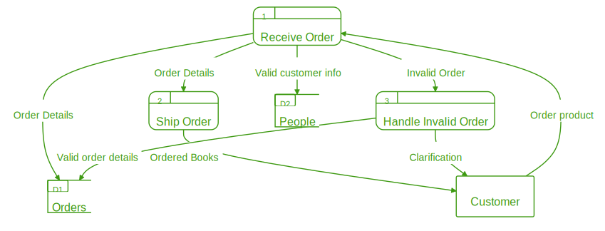

# Data-flow Diagrams.





## Description

A Data-flow diagram (DFD) is a way to represent how data flows between entities, data stores and processes in a system (or business process).

### Symbols

- Entities: External actors that interact with the process/system.
- Processes: The activities that receive an input and generate and output.
- Stores: The data repositories use to retrieve and store information.

## Creating a DFD:

Start by declaring the entities, processes and stores. 
For each element you define a label and the identifier:

```

PROCESSES:

"Receive Order" as receive
"Ship Order" as ship
"Handle Invalid Order" as handleinvalid

ENTITIES:

"Customer" as customer

DATA STORES:

"Orders" as orders
"Customers" as customers
```


Then, declare the links between the elements previously defined inside the "FLOWS" category. Each line contains the source, target and a short description that represents the output of the source element (and the input of the target element).

```
FLOWS:

customer -> receive "Order product"
receive -> orders "Order Details"
receive -> ship "Order Details"
ship -> customer "Ordered Books"

receive -> handleinvalid "Invalid Order"
handleinvalid -> customer "Clarification"
handleinvalid -> orders "Valid order details"
receive->customers "Valid customer info"
```

The resulting diagram:


