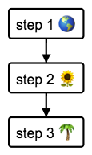

# Flowchart Diagrams.


## Actions

Every line with a quoted string is considered an action or step in the process.

For example:

```
"step 1 🌎"
"step 2 🌻"
"step 3 🌴"
```


Results in:



**Note: Make sure strings are quoted.**


### Multiple lines

Use ```<br>``` or ```\n``` to break lines:


```
"Action 1"
"Action 2 <br> multiple lines"
```


## Loops

If you repeat the name of the action it will create loop:

```
"step 1"
"step 2"
"step 3"
"step 1"
```

Results in:


## Conditions

With the ```if``` keyword you can add conditionals.

```
"step 1"
"step 2"
"step 3"
if "some condition"
  "step 4"
  "step 5"
else
  "step 6"
end if

```

Results in:


## Nested conditions

You can nest conditions. Remember to close them with ```end if```

```
if "A"
  if "B"
    "action 1"
  else
    "action 2"
  end if
else
  "other action"
end if

```


## Comments

Add comments to your diagrams with the # character.

Example:

```
# This is a comment line.
# This is another comment.

```

**Note: Comments have to be on their own line.**


