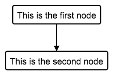

# Graph


## Connecting nodes:

Link two nodes 

```
cause -> effect
```


**Note: Use quoted strings if the node names contain spaces or other special characters**


```
"One node with emoji 🌎" -> "Another node"
```


You can declare multiple children at once:

```
a->b,c,d
```


That's equivalent to:

```
a->b
a->c
a->d
```


## Line breaks.

If a line break is found inside a text string
it will be properly rendered.

```
parent -> "this text
has a line break"
```


You can also use the following characters to introduce line breaks
- ```<br>```
- ```\n```


For example:

```
"Parent <br> Node" -> "Child Node"
```

is equivalent to:

```
"Parent \n Node" -> "Child Node"
```


## Link labels

To add labels to the connection between nodes add ```["The label"]``` after the target node.

Example: 

```
a->b["The label"]
```


Example:

```
a->b["label for b"],c["label for c"],d["label for d"]
```


## Use aliases to reduce typing.

Use aliases to add short identifiers to text nodes.


```
"This is the first node" as first
"This is the second node" as second

first->second
```




Another benefit of aliases is that it makes it easy to change the
name of nodes in only one place.

## Multiple graphs.

You can add multiple graphs, they are detected automatically
and painted next to each other

```
a->b,c,d
e->f,g,h
```


## Hide arrows

To hide arrows add the following line to the beginning of the document:

```
NO ARROWS
a->b,c,d
e->f,g,h
```


## TeX support (Desktop version only)

Nodes can display Latex expressions.

```
TEX"c = \pm\sqrt{a^2 + b^2}" as expression
root->expression
```


Please refer to [https://katex.org/docs/supported.html](https://katex.org/docs/supported.html) for details on supported Tex Functions.

