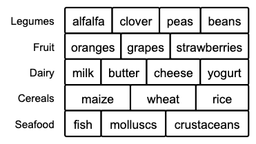
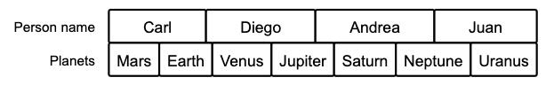

# Layer Stack




The conventions used to create a layer stack diagram are:

- Each line corresponds to a layer.
- The first name corresponds to the layer name.
- Layer items are separated by commas.
- Use ```->``` to start listing the layer items.


Example:

```
"Person name" -> "Carl","Diego", "Andrea", "Juan"
"Planets" -> "Mars","Earth", "Venus", "Jupiter","Saturn","Neptune", "Uranus"

```


