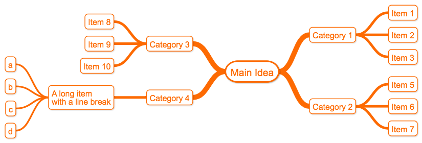
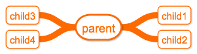
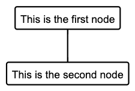
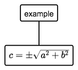
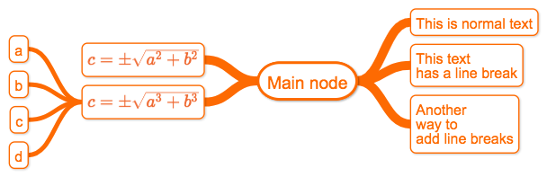

# Mind Maps





## Adding a child to a node

The basic convention to declare a parent-child relation is:

```
parent -> child
```


**Note: Use quoted strings if the node names contain spaces or other special characters**


```
"Parent Node 🌎" -> "Child node","Second child"
```


###  Adding more than one child in the same line

Let's add 3 children to the main node, there are two ways to do it:

```
parent -> child1
parent -> child2
parent -> child3
parent -> child4
```

Or, in one line separated by commas:

```
parent -> child1, child2, child3, child4
```

Both produce the same result




## Line breaks.

If a line break is found inside a text string
it will be properly rendered.

```
parent -> "this text
has a line break"
```


You can also use the following characters to introduce line breaks
- ```<br>```
- ```\n```


For example:

```
"Parent <br> Node" -> "Child Node"
```

is equivalent to:

```
"Parent \n Node" -> "Child Node"
```


## Use aliases to reduce typing.

Use aliases to add short identifiers to text nodes.


```
"This is the first node" as first
"This is the second node" as second

first->second
```



## TeX support (Desktop version only)

Nodes can display TeX expressions.

```
root -> TEX"c = \pm\sqrt{a^2 + b^2}"
```



Please refer to [https://katex.org/docs/supported.html](https://katex.org/docs/supported.html) for details on supported Tex Functions.


## Example with multiple Mind Map features



```
"Main node" as root
root->"This is normal text"

# Let's add 2 nodes with line breaks
root->"This text
has a line break"

# Using \n or <br/> 
root->"Another <br>way to \nadd line breaks"

# Add a TeX node
root->TEX"c = \pm\sqrt{a^2 + b^2}"
# Add another Tex node with alias "expression"
root->TEX"c = \pm\sqrt{a^3 + b^3}" as expression
# Add child nodes to "expression"
expression->a,b,c,d


```


