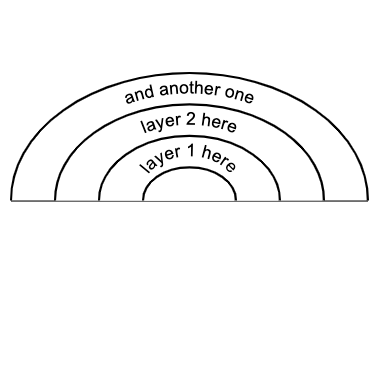

# Onion Layers

Onion layers have a simple list of conventions:

- Each line represents a layer.
- Strings have to be surrounded by quotes.

## Example:

```
"layer 1 here"
"layer 2 here"
"and another one"
```

### Result:


