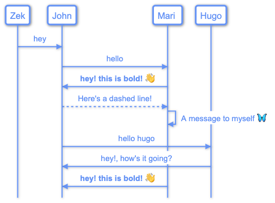
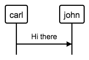
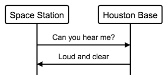
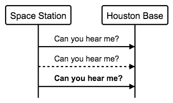

# Sequence Diagrams.




Sequence diagrams are composed of:

- Actor names.
- Messages between actors.

Example of a basic diagram:

Here Carl will send the message "Hi There" to John:

```
carl->john:"Hi there"
```


## Use aliases to avoid typing long actor names.

Aliases avoid unnecesary repetition of the actor names.

In this example we set two aliases, "s" for "Space Station"
and "h" for "Houston Base".

After setting aliases you can use them instead of the actor names.


```
"Space Station" as s
"Houston Base" as h

s->h:"Can you hear me?"
h->s:"Loud and clear"
```



**Aliases are needed if the actor name contains spaces or special characters**


There's another way to define aliases (old way - still supported)

```
alias s="Space Station"
alias h="Houston Base"

s->h:"Can you hear me?"
h->s:"Loud and clear"
```


## Message line style:

If you want to highlight a message between actors you can use
the following notations:

A -> B  : Normal line message.

A --> B : Dashed line message.

A => B  : Bold line message.

Example:

```
"Space Station" as s
"Houston Base" as h

s->h:"Can you hear me?"
s-->h:"Can you hear me?"
s=>h:"Can you hear me?"

```




## Comments

Add comments to your diagrams with the **#** character.

**Note: Comments have to be on their own line.**

Example:

```
# This is a comment line.
# This is another comment.

```
