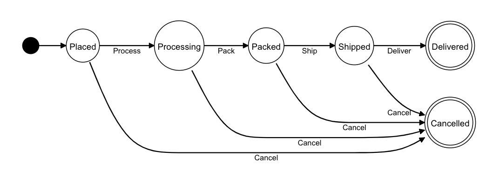
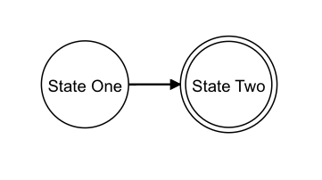
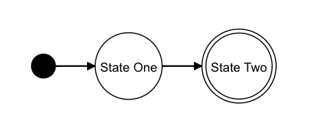
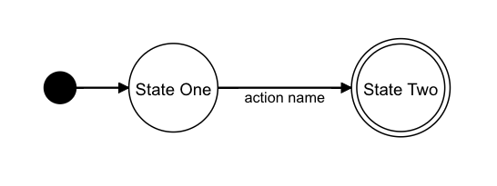
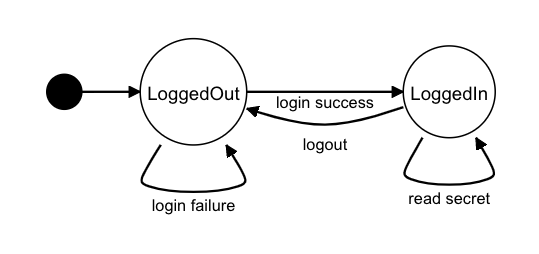

# State Machine Diagram



The State Machine diagram represents the possible states that a system could have during its lifetime, each new state is the result of being at an arbitrary previous state with some action being applied to the system that makes the system change.

## State Transition
A state in a system is represented by a circle shape, the transition from one state to another is represented by an arrow.


To define a state transitioning to another state, specify the state name in quotes `""` and create the transition relation with the arrow `->` notation

```
"State One"->"State Two"
```



Here you can see that the nodes and the transition connections are automatically created and aligned for you.
Also, you can see that the terminal state (State Two) is wrapped in a bigger circle, this notation allows you to easily detect terminal states. The terminal state convention is automatically detected and no special notation is required.

## State Transition with Generic Start State
In the state machine diagrams most of the time a generic start state is shown, you can optionally create it by specifying the keyword `START` as the initial state:

```
START->"State One"
"State One"->"State Two"
```


## State Transition with Action
You can explicitly declare the action name that is responsible for the state transition with the notation `["action name"]` at the end of the state node transition declaration:
```
START->"State One"
"State One"->"State Two"["action name"]
```


Here "action name" is any name you specify to describe the action.

## More States
Here is a more complete example of multiple states with their respective action relations, note that is only required to specify the node names as strings with their respective connections, and DiagramCodes will automatically figure it out the best layout placement.


```
START->"LoggedOut"
"LoggedOut"->"LoggedIn"["login success"]
"LoggedIn"->"LoggedOut"["logout"]
"LoggedOut"->"LoggedOut"["login failure"]
"LoggedIn"->"LoggedIn"["read secret"]
```




## Reference Example 


```
START->"Placed"
"Placed"->"Processing"["Process"]
"Processing"->"Packed"["Pack"]
"Packed"->"Shipped"["Ship"]
"Shipped"->"Delivered"["Deliver"]

"Placed"->"Cancelled"["Cancel"]
"Processing"->"Cancelled"["Cancel"]
"Packed"->"Cancelled"["Cancel"]
"Shipped"->"Cancelled"["Cancel"]
```