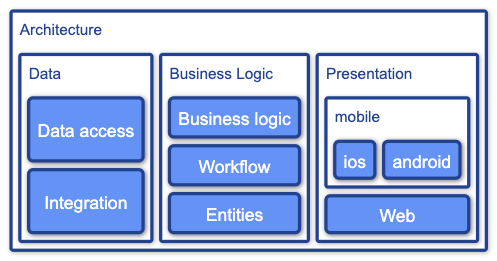
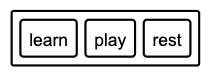
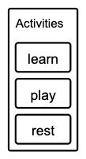
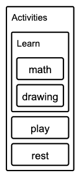
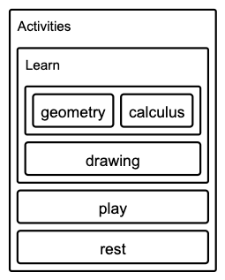
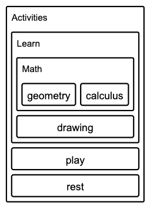
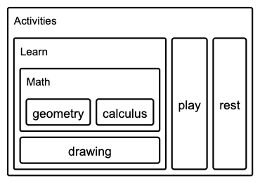
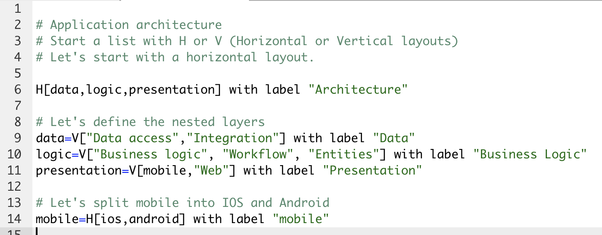

# System Layers



## Creating a layer

Let's create a simple diagram with a container and a list of items.


```
horizontal[learn,play,rest]
```


- you can use horizontal or vertical.
- use H or V as a shortcut to horizontal - vertical.
- The list of items is surrounded by square brackets []

**Note: Use quoted strings for items that contain spaces or special characters**


## Naming containers.

You can add a label to the container. 

Let's add the name "Activities" to our horizontal list (It starts with H).


```
H[learn,play,rest] with label "Activities"
```


- The label of the container box is defined using ```with label "Name of the box"```


**Note: The first list defined will be the top container**

Let's change H for V to arrange items vertically

```
v[learn,play,rest] with label "Activities"
```



## Nested lists

You can nest lists to create complex hierarchies.

Let's extend our example by creating a list where the "learn" element is located.

Learn will now contain 2 elements "math" and "drawing".

```

v[learn,play,rest] with label "Activities"

learn=v[math,drawing] with label "Learn"

```

This produces the following diagram:




Now, let's sub divide again, this time we'll split "math" into "geometry" and "calculus".

```
v[learn,play,rest] with label "Activities"

learn=v[math,drawing] with label "Learn"
math=h[geometry,calculus]
```




- Notice that the "math" label is not present anymore. Because we converted the item to a list, we need to add a label to it if we want to show "math" as the container name.


```
v[learn,play,rest] with label "Activities"

learn=v[math,drawing] with label "Learn"
math=h[geometry,calculus] with label "Math"
```




Let's change the layout of the root container to "horizontal".
For the sample data this will improve the spatial distribution of elements.

Just change "v" for an "h" (horizontal) in the first line

```
h[learn,play,rest] with label "Activities"

learn=v[math,drawing] with label "Learn"
math=h[geometry,calculus] with label "Math"
```



## Line breaks

Line breaks are supported for text strings surrounded by double quotes.

Other ways to define line breaks:

- ```\n```
- Use ```<br>```


## Comments.

Comments are supported with the # character. 

The editor will display comments with a different style.




