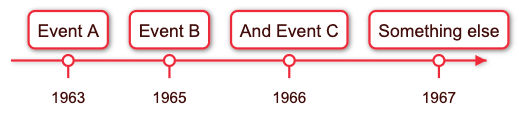
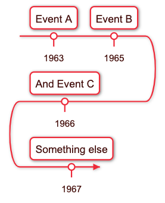

# Timeline



## Conventions

Each line has the following pattern:

```
"Event Date": "Event Name"
```

- Each line corresponds to a pair of event name and date.
- Date and name are separated by ```:```

```
"1963" : "Event A"
"1965" : "Event B"
"1966" : "And Event C"
"1967" : "Something else"
```

### Time line width

You can set the width of the diagram and it will be re arranged

Start the diagram with the line:
```width=number of pixels```

Example, constraining width to 200:

```
width=200
"1963" : "Event A"
"1965" : "Event B"
"1966" : "And Event C"
"1967" : "Something else"
```



