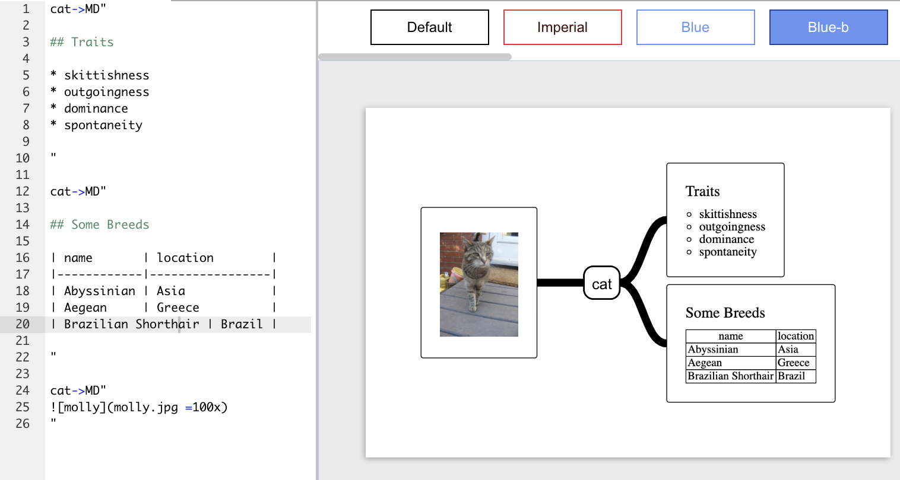

# Markdown Support available 

Starting from version 1.0.26 it's now possible to include Markdown text in diagram elements.
This makes it possible to include images, tables, lists and more.

To include Markdown as the content of a node use the prefix MD before the contents of the node (surrounded by double quotes) e.g ```MD" node contents "```


Let's take a look at an example:




### Notes

- Local images are supported (image path is relative to the diagram location)
- Image size can be controlled by adding ```=200x100``` or ```=200x``` for automatic height

### The full diagram code:


```
cat->MD"

## Traits

* skittishness
* outgoingness
* dominance
* spontaneity
"

cat->MD"

## Some Breeds

| name       | location        |
|------------|-----------------|
| Abyssinian | Asia            |
| Aegean     | Greece          |
| Brazilian Shorthair | Brazil |

"

cat->MD"

"
```


